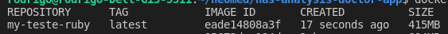

# Infra Ruby com Dockerfile multi-stage + nginx para assets + Postgresql 
Este é um projeto pessoal com objetivo de entender e criar as etapas necessárias para uma infra estrutura toda automatizada com docker-compose para linguagem Ruby. 

#### Versão da imagem

  - Ruby:2.7.2-alpine
  - postgresql:14.1
  - nginx:1.17-alpine
  - Docker-compose versão '3.7'
  - 
#### Variáveis

  - `DATABASE_URL: postgres://postgres:postgres@db:5432/my-test-db`
    - Variável de ambiente utilizada pela aplicação para se conectar no banco de dados.
    - **Formação da variável**
      - `postgres://` *=> Definir o driver a ser utilizado pela aplicação rm Ruby*
      - `postgres:postgres` *=> usuário:senha-do-banco*
      - `@db` *=> nome ou endereço de conexão no banco de dados, neste caso é o nome **db** que refere-se ao nome do serviço no arquivos docker-compose.*
      - `:5432` *=> porta de conexão do banco de dados*
      - `/my-test-db` *=> definir o nome do banco de dados.*
      - 
## Iniciar a aplicação

 **`docker-compose up -d --build && docker-compose run app rake  db:setup`**
 - docker-compose up -d --build => faz o trabalho de build da aplicação carreta toda a arquitetura necessária.
 - docker-compose run app rake db:setup => executa o comando dentro do serviço **app**  para criar o banco, carregar os schema e seed.
 - 
## Imagem DockerFile

  Ao trabalhar com um projeto de uma aplicação em ruby utilizando uma imagem padrão do ruby e sem realizar nenhum processo de limpeza a imagem final da aplicação ficou com **1.54Gb** segue imagem:

  

  Se pensarmos em apenas uma aplicação pode parecer pouco, mas se multiplicarmos por algumas dezenas de aplicações e versões diferente, pode começar a ter um custo alto de armazenamento mas o pior é o tempo de execução da pipeline. segue um exemplo de custo baseado no gcp.

   

  O custo pago pelo armazenamento é pequeno comparado ao custo de tempo  para uma aplicação realizar o deploy e entrar em produção. **O tamanho da imagem está diretamente ligado ao tempo que uma pipeline vai demorar para subir uma aplicação**. Quanto menor a imagem mais rápida  será o deploy. 

## DockerFile multistage

  Neste dockerfile iremos trabalhar com as melhorias:
  - *Remoção de arquivos desnecessário*;
  - *Criar build de imagem tipo multi-stage*;
  - *Recurso em  camadas*.
  
#### Detalhamento do DockerFile

1. Carregar imagem e instalar dependências 

Nesta etapa estamos utilizando três camadas:

  - FROM => definir imagem  e nome  **pre-builder**.
  - RUN => Instalar as dependências é importante que todos os comando de instalação fiquem juntos na mesma layer assim aproveitarmos do cache de layer, e reduzir tempo de build e próximas compilações que altera apenas o código fonte.
  - ENV => exporar a variável do yarn para todas as outras camadas do **pre-builder**. 
```
# Definir imagem a ser utilizada para aplicação has backend
FROM ruby:2.7.2-alpine as pre-builder
# Instalar dependências necessárias  e remover cache de instalação
RUN apk add --update --no-cache \
    openssl \
    tar \
    build-base \
    tzdata \
    postgresql-dev \
    postgresql-client \
    nodejs \
  && wget https://yarnpkg.com/latest.tar.gz \
  && mkdir -p /opt/yarn \
  && tar -xf latest.tar.gz -C /opt/yarn --strip 1 \
  && mkdir -p /app
# exportar PATH com binário do yarn para todas as próximas camadas.
ENV PATH="$PATH:/opt/yarn/bin"
```
2. Carregar variáveis da aplicação no início, assim todas as camadas seguinte pode aproveitar destas definições. 
```
#Definir variáveis utilizada pela aplicação.
ENV RAILS_ENV='production'
ENV RACK_ENV='production'
ENV SECRET_KEY_BASE=dummy
ENV RAILS_ROOT  /app
ENV PORT=5000
```
3. Definir diretório de trabalha utilizando as variáveis anteriores.
```
# Definir diretório de trabalho padrão.
WORKDIR $RAILS_ROOT
```
4. Copiar os arquivos de definições das Gem antes de carregar a aplicação, este método ajuda a evitar de realizar o bundle install todas as vezes que for alterado o código da aplicação sem alterar as Gem.
Também realizamos a instalação do bundle desejado e suas definições. Logo em seguida já realizamos a instalação das gem e fazemos a remoção de todos os arquivos de cache que não são utilizados no momento de execução da aplicação tudo na mesma camada.

```
COPY Gemfile Gemfile.lock ./
# Instalar bundler de requisito da aplicação.
RUN gem install bundler:2.2.15 \
    && bundle config set without 'development test' \
    && bundle install --jobs 20 --retry 5 \
    && rm -rf /usr/local/bundle/cache/*.gem \
    && find /usr/local/bundle/ -name "*.c" -delete \
    && find /usr/local/bundle/ -name "*.o" -delete
```
5. Copiar a aplicação e todos os seus arquivos e gerar os arquivos estáticos **Assets**. Após compilar os assets já fazemos a limpeza do cache utilizado pelo yarn, que também deve ser realizado nesta camada.

```
# Copiar toda aplicação para o WORKDIR
COPY . .
# Gerar os assets  da aplicação
RUN bundle exec rake assets:precompile && yarn cache clean
```
6. Agora vamos criar nossa imagem final copiando apenas os arquivos importantes.
Vamos utilizar novamente a imagem alpine que já é pequena e com os ajustes vamos ter apenas o que é necessário para aplicação funcionar. 

```
# Final Build
FROM ruby:2.7.2-alpine 
# Definir variáveis da aplicação
ENV RAILS_ENV='production'
ENV SECRET_KEY_BASE=dummy
ENV RAILS_LOG_TO_STDOUT true
ENV RAILS_ROOT  /app
ENV PORT=5000
```
7. Instalar as dependências que não vem por padrão na imagem alpine e realizar a limpeza do cache.
```
# Instala depedências
RUN apk add --update --no-cache \
    openssl \
    tzdata \
    postgresql-dev \
    postgresql-client && rm -rf /var/cache/apk/*
```
8. Criar diretório de trabalho e definir como workdir.
```
# Criar diretório de trabalho
RUN mkdir $RAILS_ROOT
# Definir diretório de trabalho padrão.
WORKDIR $RAILS_ROOT
```
9. Copiar os arquivos compilados no primeiro estágio. É importante observar o caminho **/usr/local/bundle** porque é o local padrão onde está instalado as Gem, e como não iremos realizar o bundle novamente devemos copiar os binários. O diretório /app e a nossa aplicação.
  
```
# Copiar os arquivos
COPY --from=pre-builder /usr/local/bundle /usr/local/bundle
COPY --from=pre-builder /app/ /app/
```
10. Expor a aplicação e iniciar.

```
# Expor a porta externamente
EXPOSE $PORT
# Iniciar a aplicação 
CMD ["rails", "server", "-b", "0.0.0.0"]
```
Ao longo de todo dockerfile trabalhamos com as definições das variáveis realizada no inicio, o que facilita bastante.

11. Agora vamos ignorar os arquivos não necessário para o projeto com o uso do **.dockerignore**, devemos declarar que não é necessário para aplicação. Exemplo: o próprio DockerFile, readme, env, cache e outros.

Com todas as definições realizada ao gerar nossa imagem novamente ela ficou com **415MB** uma redução de **73%** a imagem ficou quase 4X menor, agora temos custo menor de armazenamento, mais velocidade no deploy porque a imagem é menor e ainda temo as opções de reaproveitamento de camadas, que garante mais velocidade no momento do build e o deploys mais rápidos.



## Docker-compose

O docker-compose cria um forma de automatizar todo o processo de build e runner da aplicação de forma que com apenas um comando podemos ter todo o nosso ambiente pronto.

1. Definindo os recursos 
  
Trabalhar com a definição de recurso no início do arquivo facilita no momento do *troubleshooting* por estar mais visível.
```
version: '3.7'
networks:
  has_docker:
    driver: bridge
volumes:
  app_assets:
```
1. Definir primeiro os serviços que são dependências, assim facilita para saber quem deve ser iniciado primeiro visualmente. 

*É importante lembrar que o nome usado no serviço será o DNS também utilizado dentro da aplicação. Utilizando de versões mais novas do docker-compose não necessitamos de informar o parâmetro **link**, porque toda network já tem um serviço de resolução de nome internos.*

```
services:
  db:
    image: postgres:14.1
    environment:
      POSTGRES_PASSWORD: postgres
    ports:
      - 5432:5432
    networks:
      - has_docker
```
2. Iniciar o serviço da aplicação realizando o build. Temos que definir a URL de conexão do banco como variável para aplicação.

```
  app:
    image: my-teste-ruby
    environment:
      DATABASE_URL: postgres://postgres:postgres@db:5432/has_analysis_doctor_app_test
    build: 
      dockerfile: Dockerfile
      context: .
    volumes:
      - app_assets:/app/public
    ports:
      - 5000:5000
    networks:
      - has_docker
    depends_on:
      - db
```
1. Iniciar o nosso web_server para fornecer o arquivos estáticos e realizar um proxy_pass com a aplicação. É necessário pois por padrão o ruby não carrega os arquivos estático é recomendado utilizar um serviço de webserver para ganhar velocidade na aplicação.

*Para que o nginx consiga carregar os arquivos estáticos devemos mapear o diretório **/app/public** junto a imagem do nginx e definir como **directory Root** do nginx*

##### Definições dos volumes

  - app_assets => volume que foi montando na image **app** e carregados os assets.
  - $PWD/nginx => monta o diretório nginx dentro do projeto e carrega o arquivo de configuração do nginx para o diretório default **/etc/nginx/conf.d**

```
  web:
    image: nginx:1.17-alpine
    volumes:
      - app_assets:/app/public
      - $PWD/nginx:/etc/nginx/conf.d
    networks:
      - has_docker
    ports:
      - 80:80
    depends_on:
      - app
```
## Configurações importante do Nginx

O web serve Nginx possui várias configurações mas para funcionar como proxy pass é importante observar esta configurações abaixo:

1. Definir um nome para  conexão upstrem que pode ser qualquer nome. Deve ter atenção ao conector que é o **server** e a URI de conexão que é **app:5000**.
```
upstream rails_app {  
   server app:5000;
} 
```
2. Definir o *server_name* e o *Directory Root*, no caso é o mesmo onde foi montado o volume.

```
server {  
   # define your domain  
   server_name localhost;   
   # define the public application root  
   root   /app/public; 
```
3. Verificar a url de conexão do *proxy_pass*, tem que ser igual as configuração do **upstream**

```
      proxy_pass http://rails_app; 
```

